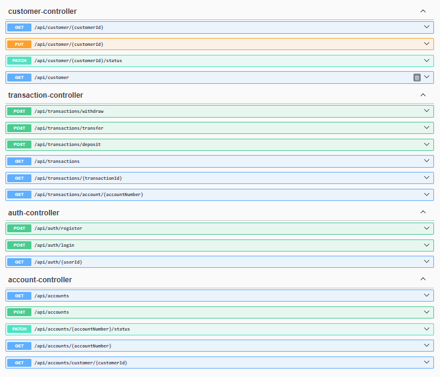
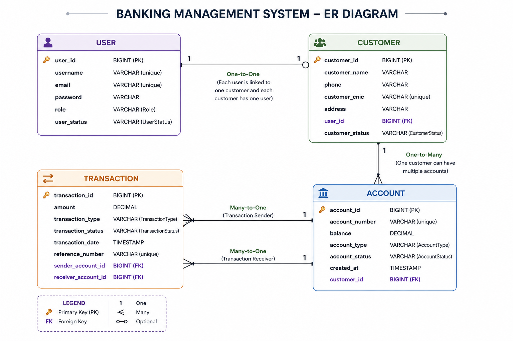

# Banking Management System

A RESTful Banking Management System built with **Java Spring Boot** that enables customer, account, and transaction management through secure and well-structured APIs.

The project follows a layered architecture and demonstrates backend development best practices including DTOs, Bean Validation, centralized exception handling, and database integration using PostgreSQL.

> **Project Status:** Increment 3 Completed ✅
> **Implemented:** Spring Security & JWT Authentication, Automated Background Jobs (Interest Accrual)

---

## Features

### Authentication & Security

- User Registration
- User Login
- Spring Security
- JWT Authentication
- Stateless Session Management
- BCrypt Password Encryption
- JWT Authentication Filter
- Protected REST APIs
- Authentication using Bearer Tokens

### Customer Management
- Create Customer
- Retrieve Customer(s)
- Update Customer Information
- Activate / Deactivate Customer

### Account Management
- Create Bank Account
- Retrieve Account Details
- Retrieve Customer Accounts
- Activate / Freeze / Close Account

### Transaction Management
- Deposit Money
- Withdraw Money
- Transfer Money Between Accounts

### Background Jobs
- Automated Daily Interest Accrual for Savings Accounts
- Scheduled Execution via Spring `@Scheduled`
- Manual Trigger Endpoint for On-Demand Execution
- Defensive Handling of Incomplete Account Data
- Structured Logging for Job Auditability


### Additional Features
- Layered Architecture
- Request & Response DTOs
- Bean Validation
- Global Exception Handling
- Custom Error Responses
- Swagger UI Documentation

---

## Tech Stack

- Java 21
- Spring Boot
- Spring Data JPA
- - Spring Security
- JSON Web Token (JWT)
- PostgreSQL
- Maven
- Lombok
- Swagger / OpenAPI

---

## Project Structure

```text
src
└── main
    ├── controller
    ├── service
    ├── serviceimpl
    ├── repository
    ├── model
    ├── requestdto
    ├── responsedto
    ├── security
    ├── config
    ├── exception
    ├── enums
    └── resources
```

---

##  Layered Architecture

```
Client
   │
   ▼
Controller
   │
   ▼
Service
   │
   ▼
Repository
   │
   ▼
PostgreSQL Database
```

---


---

```md

## Security Architecture

The application uses Spring Security with JWT-based authentication.

```text
Client
   │
   │ Login Credentials
   ▼
Auth Controller
   │
   ▼
Authentication Manager
   │
   ▼
UserDetailsService
   │
   ▼
PostgreSQL Database
   │
   ▼
JWT Token Generated
   │
   ▼
Client
   │
   │ Bearer Token
   ▼
JWT Authentication Filter
   │
   ▼
JWT Validation
   │
   ▼
Security Context
   │
   ▼
Protected APIs

---


---

## Background Job Architecture

The system automatically credits interest to eligible savings accounts on a recurring schedule, without requiring any user-initiated request.

```text
Spring Scheduler (Cron Trigger)
   │
   ▼
InterestAccrualScheduler
   │
   ▼
AccountService
   │
   ├──► Fetch eligible accounts (SAVINGS + ACTIVE)
   ├──► Calculate interest per account
   ├──► Update account balance
   └──► Record transaction (type: INTEREST)
   │
   ▼
PostgreSQL Database
```

### How it works

- A scheduled job runs once every 24 hours (`0 0 0 * * *` — midnight) using Spring's `@Scheduled` annotation.
- The job queries all accounts where `accountType = SAVINGS` and `accountStatus = ACTIVE`.
- For each eligible account, interest is calculated as `balance × interestRate`, credited to the account, and recorded as a new `Transaction` with type `INTEREST`.
- Accounts with a missing interest rate or balance are safely skipped rather than causing a failure, ensuring the job is resilient to incomplete data.
- Each run logs a summary — accounts found, accounts credited, and total interest credited — making job execution observable and auditable.

### Manual Trigger

Since scheduled jobs are not practical to demonstrate live, a protected endpoint allows the same logic to be triggered on demand. This calls the exact same service method used by the scheduled job, so there is no duplicated logic between automatic and manual execution.

```text
POST /api/accounts/admin/interest-accrual/run
```


## Running the Project

### Prerequisites

- Java 21
- Maven
- PostgreSQL

### Steps

1. Clone the repository

```bash
git clone https://github.com/ihtishamafridi498-stack/banking-management-system.git
```

2. Configure the PostgreSQL database in `application.properties`.

3. Run the application.

```bash
mvn spring-boot:run
```

4. Access Swagger UI after the application starts.

---
## API Documentation

Once the application is running, open the following URL in your browser to access Swagger UI:

```text
http://localhost:8080/swagger-ui/index.html
```

Swagger UI provides interactive documentation for all available REST APIs and allows users to test endpoints directly from the browser.

### Interactive API Documentation (Swagger UI)



## Database ER Diagram

The following Entity Relationship (ER) diagram illustrates the database schema and relationships between the core entities of the Banking Management System.



## API Endpoints

### Authentication

| Method | Endpoint | Description |
|---------|----------|-------------|
| POST | `/api/auth/register` | Register a new user |
| POST | `/api/auth/login` | Authenticate user |

### Customer

| Method | Endpoint | Description |
|---------|----------|-------------|
| GET | `/api/customer/{customerId}` | Get customer by ID |
| GET | `/api/customer` | Get all customers |
| PUT | `/api/customer/{customerId}` | Update customer details |
| PATCH | `/api/customer/{customerId}/status` | Update customer status |

### Account

| Method | Endpoint | Description |
|---------|----------|-------------|
| POST | `/api/accounts` | Create a new account |
| GET | `/api/accounts` | Get all accounts |
| GET | `/api/accounts/{accountNumber}` | Get account by account number |
| GET | `/api/accounts/customer/{customerId}` | Get customer accounts |
| PATCH | `/api/accounts/{accountNumber}/status` | Update account status |
| POST | `/api/accounts/admin/interest-accrual/run` | Manually trigger interest accrual job |

### Transaction

| Method | Endpoint | Description |
|---------|----------|-------------|
| POST | `/api/transactions/deposit` | Deposit money |
| POST | `/api/transactions/withdraw` | Withdraw money |
| POST | `/api/transactions/transfer` | Transfer funds |
| GET | `/api/transactions` | Get all transactions |
| GET | `/api/transactions/{transactionId}` | Get transaction by ID |
| GET | `/api/transactions/account/{accountNumber}` | Get transactions by account |

## Future Enhancements

- Refresh Token Support
- Docker Containerization
- Cloud Deployment
- Additional Security Enhancements

---

## Author

**Ihtisham Afridi**

LinkedIn: https://www.linkedin.com/in/your-linkedin-profile